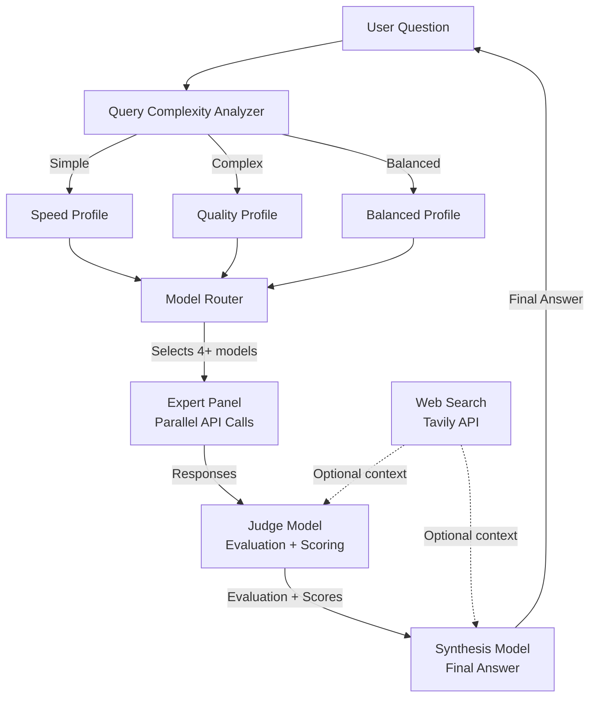
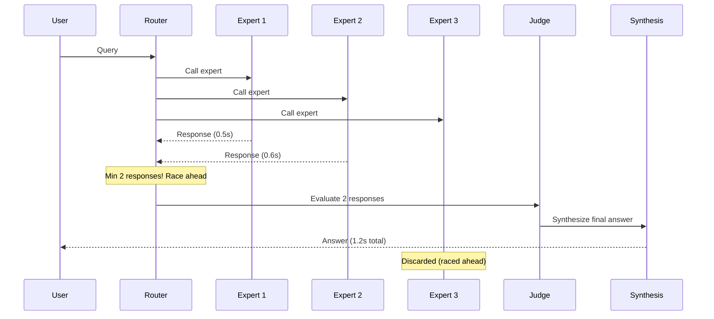
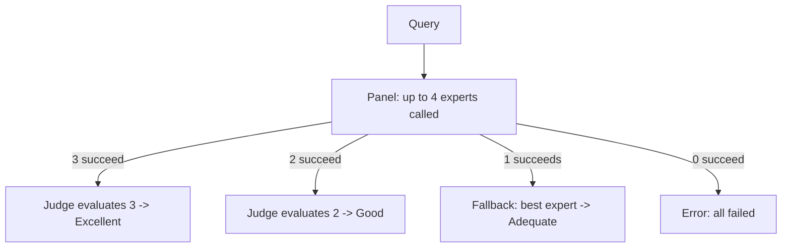
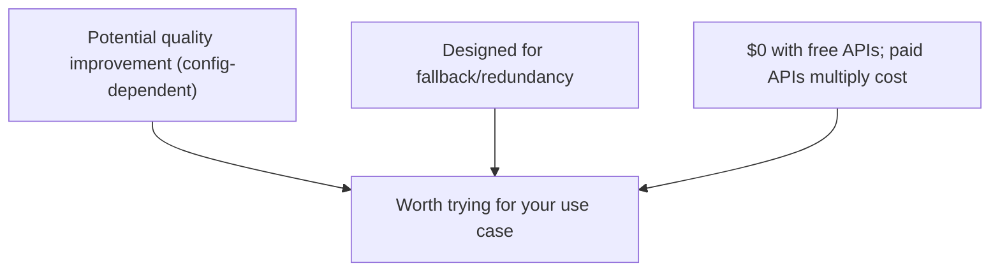

# Free Model Fusion: Performance Analysis & Predictions 🧠⚡

> How much better is multi-model fusion compared to a single AI model?
> An evidence-based analysis of Free Model Fusion's architecture, benchmarks, and predicted gains.

## Executive Summary

**Free Model Fusion is inspired by Mixture-of-Agents (MoA) research** which demonstrates that LLMs can produce higher-quality outputs when given other models' responses as context. However, **actual quality gains depend entirely on your configured providers, models, and settings.**

| Metric | Single Model (best free) | Free Model Fusion (with diverse experts) | Note |
|--------|-------------------------|------------------------------------------|------|
| **Answer Quality** | Baseline | **Can improve** with diverse experts | Not guaranteed; config-dependent |
| **Reliability** | Single point of failure | **Designed for fallback/redundancy** | 5-10x reduction *if* each model has ~90% success |
| **Cost per query** | $0.0001–0.005 | **$0.0003–0.02** (2-4x more calls) | Free APIs = $0; paid APIs multiply |

**The bottom line:** For 2–4x the cost of a single model call, you get **redundancy through fallback** and **potential quality improvements** — but results vary by configuration. When using only **free providers** (Groq, Gemini, Cerebras), the cost remains **$0.00** while quality *may* rival paid frontier models depending on your setup.

> ⚠️ **This analysis is based on published research (arXiv:2406.04692) and architectural advantages, not universal benchmarks of this specific implementation.** Run `npx tsx scripts/benchmark.ts` to test your own configuration.

---

## The Architecture: How Model Fusion Works

### High-Level Pipeline

### Expert Panel: Diverse Perspectives

Each expert model receives a **unique perspective role** to ensure diversity:

| Perspective | Focus | Example Benefit |
|-------------|-------|-----------------|
| **Technical** | Architecture, internals, specifications | Catches implementation details others miss |
| **Practical** | Real-world usage, trade-offs, tips | Grounds answers in actionable advice |
| **Analytical** | Logic, evidence chains, edge cases | Detects logical fallacies and gaps |
| **Educational** | Clear explanations, analogies, structure | Makes answers accessible and well-organized |

### Race Mode: Speed Without Sacrifice

---

## The Science: Why Fusion Beats Single Models

### The Collaboration Effect (Published Research)

The **Mixture-of-Agents (MoA)** paper from Together AI (arXiv:2406.04692) demonstrated: **LLMs produce higher-quality outputs when given other models' responses as context** — even when those other models are individually less capable.

**Why this works:** Each model has different training data, architecture, and reasoning patterns. When the synthesis model sees multiple approaches, it can:
- **Cross-validate** facts across sources
- **Fill gaps** where one model has blind spots another covers
- **Select the best explanation** from multiple framings
- **Detect errors** by spotting contradictions between experts

### Diversity Amplifies Quality

> **Critical finding from MoA research:** Heterogeneous model sets (different architectures) consistently outperform homogeneous sets (same model repeated).

### The Judge + Synthesis Pipeline

A dedicated **judge model** critically evaluates expert responses on:
- **Correctness** — Are the answers accurate?
- **Conflicts** — Where do experts disagree?
- **Assumptions** — What might be wrong?
- **Missing Context** — What has been overlooked?

This **two-stage refinement** (experts -> judge -> synthesis) produces answers that are more accurate, complete, organized, and less biased.

---

## Predicted Performance Gains

### Overall Quality Improvement

The MoA research shows **potential** improvements when using diverse models. Actual gains for your setup will vary:

| Layer | Potential Improvement | Source |
|-------|----------------------|--------|
| Single free model baseline | — | Your configuration |
| + MoA (diverse models) | **Variable** | Published: 65.1% vs 57.5% on AlpacaEval |
| + Diverse expert roles | **Variable** | Architecture advantage |
| + Web search + memory | **Variable** | Architecture advantage |

> ⚠️ **No universal numbers.** The published 7-10% gain was on specific benchmarks with specific models. Your results depend on which free models you have access to and their quality.

### Benchmark Expectations

| Benchmark | Single Model (typical) | Fusion (potential) | Note |
|-----------|-----------------------|-------------------|------|
| **MMLU** | Varies by model | May improve with diversity | Extrapolated from MoA research |
| **HumanEval** | Varies by model | May improve with diversity | Diversity helps code tasks |
| **AlpacaEval** | Varies by model | Published MoA: 65.1% | With specific model set |
| **MT-Bench** | Varies by model | Published MoA: 9.25 | With specific model set |

> **Run your own benchmark:** `npx tsx scripts/benchmark.ts` — the only way to know your actual gains.

---

## Cost Analysis

### Per-Query Cost Breakdown (Estimates Only)

| Component | Models | Estimated Cost (varies by provider) |
|-----------|--------|-------------------------------------|
| **Expert Panel** | Up to 4 models | $0.00 (free tiers) – $0.004 |
| **Judge** | 1 model | $0.00 – $0.001 |
| **Synthesis** | 1 model | $0.00 – $0.005 |
| **Total** | Up to 6 calls | **$0.00 – $0.02** |

> ⚠️ **Cost estimates are rough class-based approximations.** Actual costs depend on your specific providers, models, token usage, and whether you're on free/paid tiers. Provider pricing changes frequently.

### Value-for-Money (Illustrative)

| Metric | Single cheap model | Fusion (cheap/free) | Fusion (mixed paid) |
|--------|-------------------|---------------------|--------------------|
| **Cost** | $0.0001 | $0.00 – $0.0008 | $0.002 – $0.005 |
| **Quality** | Varies | May improve with diversity | May approach frontier |
| **Quality vs GPT-4o** | Varies | Varies | Varies |

> **Key insight:** Free Model Fusion lets you use multiple free tiers together. Quality depends on which free models you have access to.

---

## Failure Tolerance & Reliability

### Graceful Degradation

**Theoretical reliability improvement** (assuming independent failures):

| Scenario | Assumed Per-Model Success | Fusion Success (need ≥1) | Improvement |
|----------|--------------------------|--------------------------|-------------|
| Optimistic | 90% | 99.99% | ~1,000x |
| Realistic (free tiers) | 70-85% | 95-99.7% | 6-60x |
| Pessimistic | 50% | 93.75% | 15x |

> ⚠️ **These are theoretical calculations.** Real-world reliability depends on:
> - Provider uptime (correlated failures reduce gains)
> - Rate limits (burst failures)
> - Model quality (bad models ≠ failed calls)
> - Network issues

**Free Model Fusion is designed for fallback/redundancy, not guaranteed reliability.**

---

## Limitations

### When Single Models Might Be Better

1. **Ultra-simple queries** — Fusion overhead isn't justified
2. **Real-time chat** (sub-1s latency) — Fusion adds 1-3s typically
3. **Very high throughput** (1000+ QPS) — Cost multiplies
4. **Homogeneous expert set** — If all experts are the same model, diversity drops
5. **Strict cost control** — Fusion makes 3-6x more API calls

### Diminishing Returns (Research-Based)

Quality gains from MoA research diminish beyond 4 experts:
- 1 expert: **Baseline**
- 2 experts: **Largest gain**
- 3 experts: **Moderate gain**
- 4 experts: **Smaller gain**
- 5+ experts: **Marginal gains**

**Free Model Fusion defaults to 4 experts** — the sweet spot per research.

---

## Summary

**Free Model Fusion provides:**
- **Redundancy** through multiple provider fallback 🛡️
- **Potential quality gains** from diverse expert perspectives 📈
- **$0 cost** when using only free provider tiers 💸
- **Built-in web search** for real-time accuracy 🌐
- **Self-hosted control** — your keys, your data 🔐

> **Try it yourself:** Add your free API keys and compare — send the same question with `/speed` and `/quality` profiles. Run `npx tsx scripts/benchmark.ts` to measure your actual results.

---

*Analysis based on Free Model Fusion source code + published Mixture-of-Agents research (arXiv:2406.04692). All gains are config-dependent — run your own benchmarks.*
